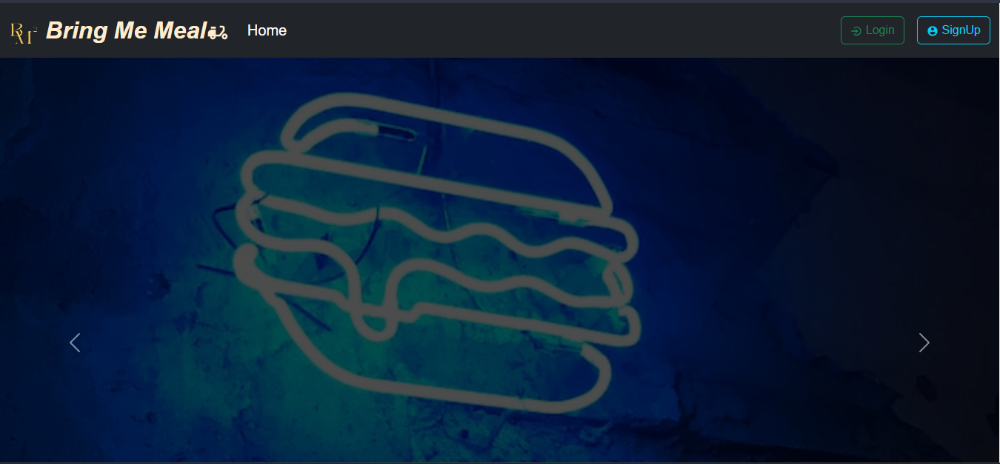
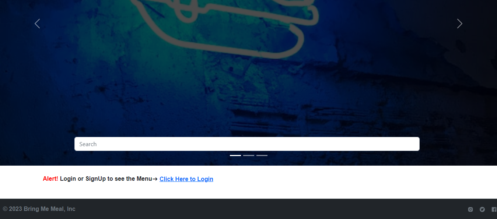
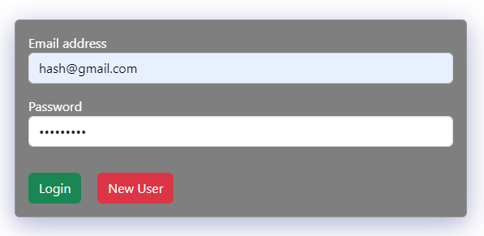
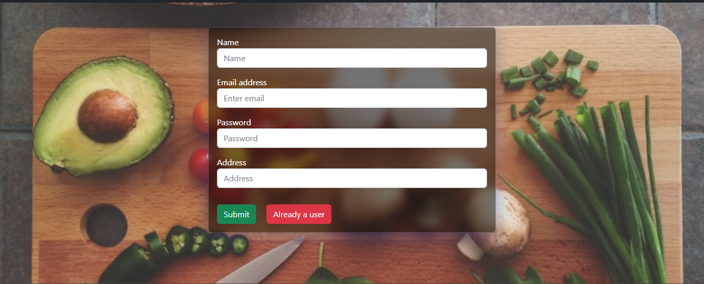
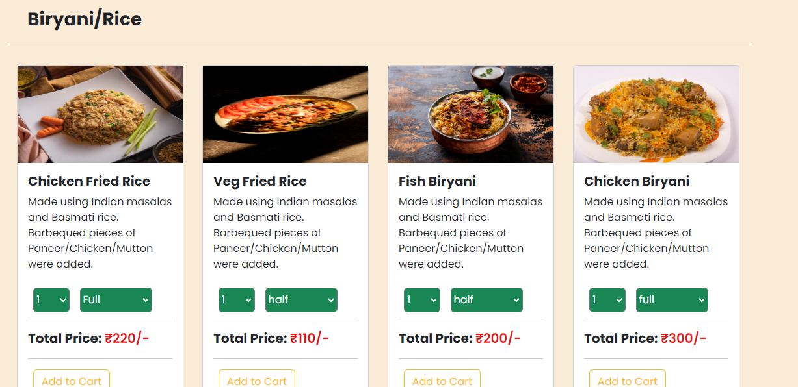
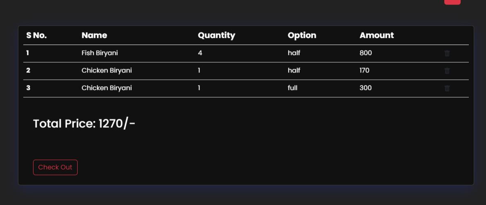
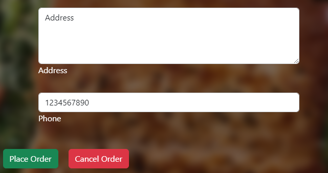
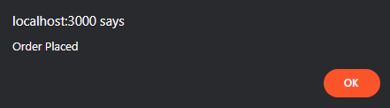

# Bring Me Meal (BM2)
Bring Me Meal is a web application built using the MERN (MongoDB, Express, React, Node.js) stack, designed to simplify the food ordering process. With its intuitive user interface and seamless functionality, Bring Me Meal allows users to browse through a variety of food categories, add items to their cart, and proceed to checkout with just a few clicks.

## Feature

### Home Pages

### 1. Login: 
Users can securely log in to their accounts, ensuring their personal information and order history are protected.

### 2. Signup Page: 
New users can create an account by providing their details and setting up a password, allowing them to access the full range of features available on Bring Me Meal.

### 3.Food Category Section: 
Users can explore various food categories, such as appetizers, main courses, desserts, and more. Each category displays a wide selection of dishes, complete with detailed descriptions and prices.

### 4. Cart Section: 
Users can add their favorite dishes to the cart, which provides a summary of selected items, quantities, and total cost. The cart dynamically updates as items are added or removed, allowing users to manage their order easily.

### 5. Checkout Button: 
Once users have finalized their selection, they can proceed to the checkout process by clicking the checkout button. This action initiates the payment process and prompts users to provide their address for delivery.

### 6. Address Section: 
Users are prompted to enter their delivery address during the checkout process, ensuring accurate and efficient delivery of their order. The entered address is securely stored and used for future reference.

## Technologies Used
### 1. MongoDB: 
A NoSQL database used for storing user information, food categories, and order details.
### 2. Express: 
A Node.js framework used for building the server-side application, handling routing, and interacting with the MongoDB database.
### 3. React: 
A JavaScript library used for building the client-side user interface, providing a responsive and dynamic user experience.
### 4. Node.js: 
A JavaScript runtime environment used for executing server-side code and handling server requests and responses.
### 5. HTML/CSS: 
Used for structuring the web pages and styling the application's user interface.

## Demo

